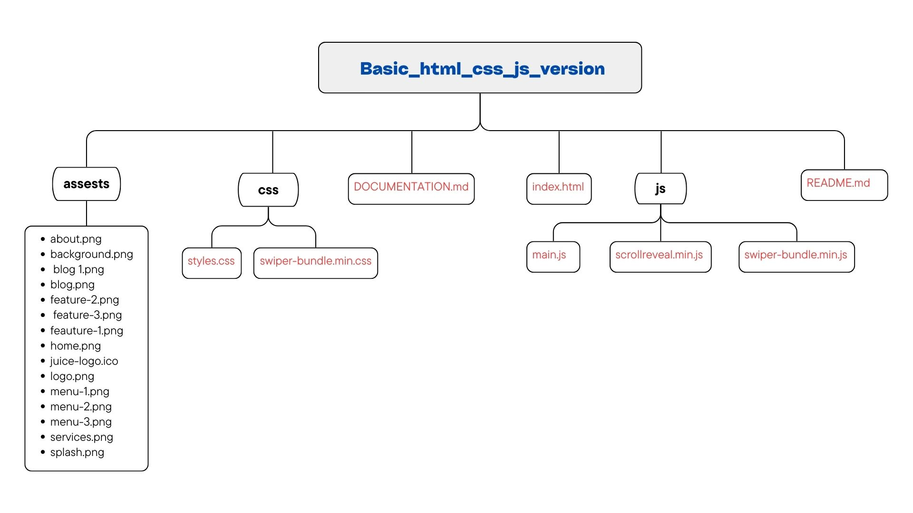

# Basic HTML, CSS, and JavaScript Juice Website Documentation

## Project Structure

The project is organized as follows:

## Files and Directories

### index.html

The main HTML file for the project. It contains the structure of the website, including the header, sections for About, Services, Blog, and Contact, and the footer.

### css/styles.css

The main CSS file for the project. It contains the styles for the website, including layout, typography, colors, and responsive design.

### js/main.js

The main JavaScript file for the project. It contains the functionality for the website, including event listeners and DOM manipulation.

### images/

This directory contains all the image assets used in the project.

- **about.png**: Image for the About section.
- **background.png**: Background image.
- **blog1.png**, **blog.png**: Images for the Blog section.
- **feature-1.png**, **feature-2.png**, **feature-3.png**: Images for the Features section.
- **home.png**: Home section image.
- **juice-logo.ico**: Logo icon.
- **logo.png**: Main logo image.
- **menu-1.png**, **menu-2.png**, **menu-3.png**: Images for the Menu section.
- **services.png**: Image for the Services section.
- **splash.png**: Splash screen image.

### README.md

Basic information and instructions for the project.

### preview.png

A preview image of the Juice Bar Website.

## Sections

### Header

Contains the navigation menu and logo.

### Hero

The hero section with a background image and a call-to-action button.

### About

Displays information about the juice company.

### Services

Shows the services offered by the juice company.

### Blog

Contains blog posts related to the juice company.

### Contact

Allows users to contact the juice company.

### Footer

Displays the footer of the website.

## Styling

The project uses plain CSS for styling. The styles are defined in the `css/styles.css` file and applied using class selectors in the HTML.

## JavaScript Functionality

The project uses plain JavaScript for interactivity. The functionality is defined in the `js/main.js` file and includes event listeners and DOM manipulation.

## License

This project is licensed under the **MIT License**.