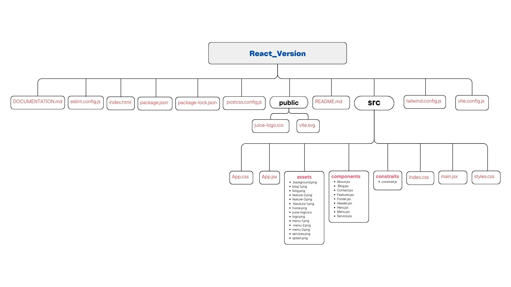

# Responsive Juice Website Documentation

## Project Structure

The project is organized as follows:

## Components

### About

**File:** `src/components/About.jsx`

Displays information about the juice company.

### Service

**File:** `src/components/Service.jsx`

Shows the services offered by the juice company.

### Blog

**File:** `src/components/Blog.jsx`

Contains blog posts related to the juice company.

### Contact

**File:** `src/components/Contact.jsx`

Allows users to contact the juice company and navigate to different sections.

### Features

**File:** `src/components/Features.jsx`

Highlights the key features of the juice company.

### Footer

**File:** `src/components/Footer.jsx`

Displays the footer of the website.

### Header

**File:** `src/components/Header.jsx`

Displays the header of the website.

### Hero

**File:** `src/components/Hero.jsx`

Displays the hero section of the website.

### Menu

**File:** `src/components/Menu.jsx`

Displays the menu of the juice company.

## Styling

This project uses **Tailwind CSS** for styling. The styles are defined in the `tailwind.config.js` file and applied using utility classes in the components.

## Transitions

The project uses **react-transition-group** for smooth transitions between components. The transition classes are defined in the `App.css` file.

## Data Management

The project uses a `constrait.js` file to manage static data for the components.

**File:** `src/constraits/constrait.js`

Contains static data for the About, Service, Blog, and Contact components.

## Configuration Files

### Tailwind CSS Configuration

**File:** `tailwind.config.js`

Configuration file for Tailwind CSS.

### Vite Configuration

**File:** `vite.config.js`

Configuration file for Vite.

## License

This project is licensed under the **MIT License**.